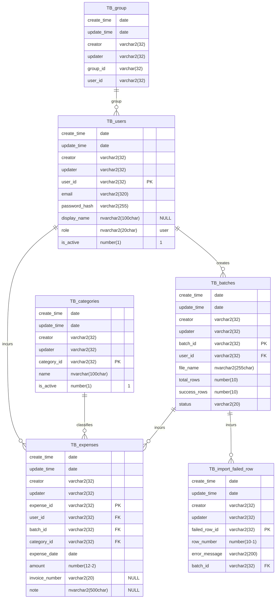

```mermaid

erDiagram

    TB_users {

        create_time date

        update_time date

        creator varchar2(32)

        updater varchar2(32)

        user_id varchar2(32) PK

        email varchar2(320)

        password_hash varchar2(255)

        display_name nvarchar2(100char) "NULL"

        role nvarchar2(20char) "user"

        is_active number(1) "1"

    }


    TB_batches {

        create_time date

        update_time date

        creator varchar2(32)

        updater varchar2(32)

        batch_id varchar2(32) PK

        user_id varchar2(32) FK

        file_name nvarchar2(255char)

        total_rows number(10)

        success_rows number(10)

        status varchar2(20)

    }


    TB_expenses {

        create_time date

        update_time date

        creator varchar2(32)

        updater varchar2(32)

        expense_id varchar2(32) PK

        user_id varchar2(32) FK

        batch_id varchar2(32) FK

        category_id varchar2(32) FK

        expense_date date

        amount number(12-2)

        invoice_number varchar2(20)  "NULL"

        note nvarchar2(500char) "NULL"


    }


    TB_categories {

        create_time date

        update_time date

        creator varchar2(32)

        updater varchar2(32)

        category_id varchar2(32) PK

        name nvarchar(100char)

        is_active number(1) "1"

    }


    TB_import_failed_row {

        create_time date

        update_time date

        creator varchar2(32)

        updater varchar2(32)

        failed_row_id varchar2(32) PK

        row_number number(10-1)

        error_message varchar2(200)

        batch_id varchar2(32) FK

    }


    TB_group{

        create_time date

        update_time date

        creator varchar2(32)

        updater varchar2(32)

        group_id varchar(32)

        user_id varchar2(32)

       

    }

   

    TB_users ||--o{ TB_batches : "creates"

    TB_users ||--o{ TB_expenses : "incurs"

    TB_categories ||--o{ TB_expenses : "classifies"

    TB_batches ||--o{ TB_expenses : "incurs"

    TB_batches ||--o{ TB_import_failed_row : "incurs"

    TB_group ||--o{ TB_users : "group"

``` 

